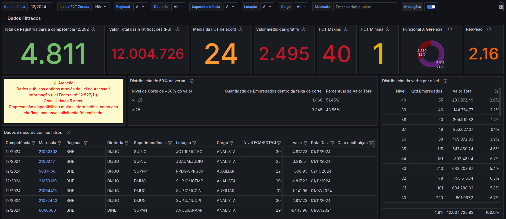
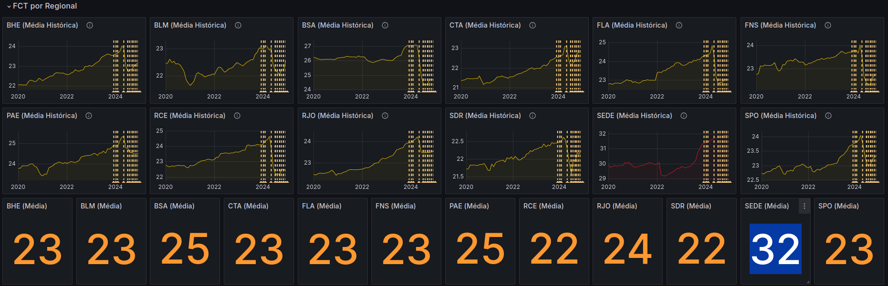
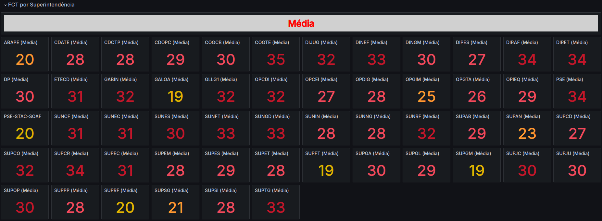
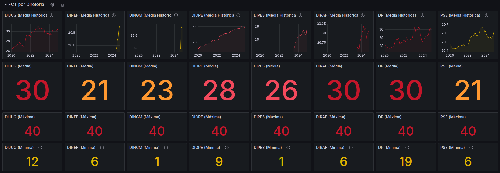
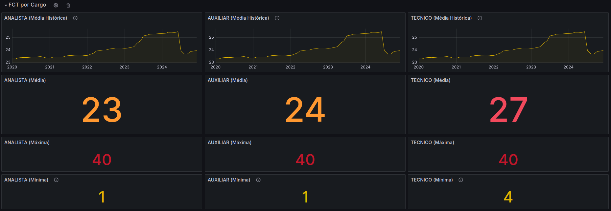

# docker-compose
Docker Compose para visualizar as gratificações

## 1. Pré-requisito (instalar):
- Docker
- Docker Compose

## 2. Rodar:
- sudo docker-compose up

## 3. Acessar:
- http://localhost:3000/
- user: admin
- password: admin2

## 4. Parar:
- sudo docker-compose down

## 5. Resolver conflito de container:
- docker container prune

## 6. Exemplos
- Gratificação Média da Empresa

- Gratificação Média Por Regional

- Gratificação Média Por Superintendêcia

- Gratificação Média Por Diretoria

- Gratificação Média Por Cargo

